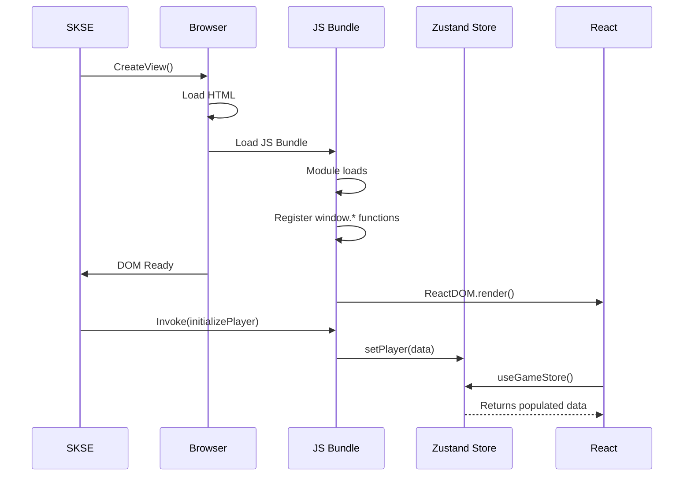

import { Aside, Code, Tabs, TabItem } from '@astrojs/starlight/components';

When using modern JavaScript frameworks like React or Vue with PrismaUI, you'll encounter a timing challenge: **the DOM becomes ready before your framework finishes mounting components**. This guide explains the problem and provides a robust solution using external state management.

## The Timing Problem

PrismaUI's communication flow creates a specific timing sequence:

1. **SKSE creates the view** using `CreateView()`
2. **DOM becomes ready** - `onDomReadyCallback` fires
3. **SKSE sends initial data** via `Invoke()` or `InteropCall()`
4. **Your framework initializes** and mounts components
5. **Components register event handlers** (if done inside lifecycle hooks)

The problem? Steps 3 and 4 can happen in the wrong order. If SKSE sends data before your React components mount and register their window functions, **that data is lost**.

### Common Pitfalls

<Aside type="caution" title="Don't Do This">
Registering window functions inside React's `useEffect` or Vue's `onMounted` means they won't exist when SKSE calls them during initial load.
</Aside>

```jsx
// ❌ This won't work reliably
function MyComponent() {
  useEffect(() => {
    // Too late! SKSE may have already called this
    window.receiveData = (data) => {
      setData(data);
    };
  }, []);
}
```

Another common mistake is creating an "isReady" handshake pattern:

```jsx
// ❌ This creates a race condition

// JavaScript side: register isReady outside React (at script load)
window.isReady = () => {
  // Try to tell SKSE we're ready by calling a function
  // that SKSE registered via RegisterJSListener
  window.sendAction('ready');  // But this might not exist yet!
};

// SKSE side (C++):
// 1. CreateView("app.html", onDomReady)
// 2. In onDomReady:
//    - RegisterJSListener(view, "sendAction", callback)  // Creates window.sendAction
//    - Invoke(view, "window.isReady()")                  // Calls your JS function

// The race condition:
// - Your JS loads and registers window.isReady ✓
// - SKSE calls window.isReady() on DOM ready ✓
// - Inside isReady(), you call window.sendAction()...
// - But RegisterJSListener might not have created window.sendAction yet! ✗
```

The issue is that `RegisterJSListener` creates functions on the `window` object from the SKSE side. If your JavaScript tries to call these functions before SKSE has registered them, the call fails silently or throws an error.

## The Solution: External State Management

The solution is to:
1. **Register window functions outside of any component lifecycle** (at script load time)
2. **Store incoming data in a global state manager** (like Zustand)
3. **Let React read from that store** when it eventually mounts

This ensures your window functions exist immediately when the script loads, before SKSE tries to call them.

## Implementation with Zustand

[Zustand](https://github.com/pmndrs/zustand) is a lightweight state manager that works perfectly for this use case because it can be accessed outside of React components.

### Project Structure

```
src/
├── store/
│   └── gameStore.ts      # Zustand store + window function registration
├── components/
│   └── PlayerHUD.tsx     # React components
├── main.tsx              # React entry point
└── index.html
```

### Step 1: Create the Store with SKSE Bridge

Create your Zustand store and register window functions **in the same file, at module level**:

<Tabs>
<TabItem label="TypeScript">
```typescript
// src/store/gameStore.ts
import { create } from 'zustand';

// Define your state types
interface PlayerData {
  health: number;
  maxHealth: number;
  stamina: number;
  maxStamina: number;
  magicka: number;
  maxMagicka: number;
  name: string;
}

interface GameStore {
  player: PlayerData | null;
  isInitialized: boolean;

  // Actions
  setPlayer: (data: PlayerData) => void;
  updateHealth: (health: number) => void;
  updateStamina: (stamina: number) => void;
  updateMagicka: (magicka: number) => void;
}

// Create the store
export const useGameStore = create<GameStore>((set) => ({
  player: null,
  isInitialized: false,

  setPlayer: (data) => set({ player: data, isInitialized: true }),
  updateHealth: (health) => set((state) => ({
    player: state.player ? { ...state.player, health } : null
  })),
  updateStamina: (stamina) => set((state) => ({
    player: state.player ? { ...state.player, stamina } : null
  })),
  updateMagicka: (magicka) => set((state) => ({
    player: state.player ? { ...state.player, magicka } : null
  })),
}));

// ============================================
// SKSE Bridge - Registers IMMEDIATELY on script load
// ============================================

// These functions are available on window BEFORE React mounts
// SKSE can safely call them as soon as DOM is ready

declare global {
  interface Window {
    initializePlayer: (jsonData: string) => void;
    updatePlayerHealth: (health: string) => void;
    updatePlayerStamina: (stamina: string) => void;
    updatePlayerMagicka: (magicka: string) => void;
  }
}

// Initialize player with full data from SKSE
window.initializePlayer = (jsonData: string) => {
  try {
    const data = JSON.parse(jsonData) as PlayerData;
    useGameStore.getState().setPlayer(data);
    console.log('[PrismaUI] Player initialized:', data.name);
  } catch (error) {
    console.error('[PrismaUI] Failed to parse player data:', error);
  }
};

// High-frequency updates (called via InteropCall for performance)
window.updatePlayerHealth = (health: string) => {
  useGameStore.getState().updateHealth(parseFloat(health));
};

window.updatePlayerStamina = (stamina: string) => {
  useGameStore.getState().updateStamina(parseFloat(stamina));
};

window.updatePlayerMagicka = (magicka: string) => {
  useGameStore.getState().updateMagicka(parseFloat(magicka));
};

console.log('[PrismaUI] SKSE bridge registered');
```
</TabItem>
<TabItem label="JavaScript">
```javascript
// src/store/gameStore.js
import { create } from 'zustand';

// Create the store
export const useGameStore = create((set) => ({
  player: null,
  isInitialized: false,

  setPlayer: (data) => set({ player: data, isInitialized: true }),
  updateHealth: (health) => set((state) => ({
    player: state.player ? { ...state.player, health } : null
  })),
  updateStamina: (stamina) => set((state) => ({
    player: state.player ? { ...state.player, stamina } : null
  })),
  updateMagicka: (magicka) => set((state) => ({
    player: state.player ? { ...state.player, magicka } : null
  })),
}));

// ============================================
// SKSE Bridge - Registers IMMEDIATELY on script load
// ============================================

window.initializePlayer = (jsonData) => {
  try {
    const data = JSON.parse(jsonData);
    useGameStore.getState().setPlayer(data);
    console.log('[PrismaUI] Player initialized:', data.name);
  } catch (error) {
    console.error('[PrismaUI] Failed to parse player data:', error);
  }
};

window.updatePlayerHealth = (health) => {
  useGameStore.getState().updateHealth(parseFloat(health));
};

window.updatePlayerStamina = (stamina) => {
  useGameStore.getState().updateStamina(parseFloat(stamina));
};

window.updatePlayerMagicka = (magicka) => {
  useGameStore.getState().updateMagicka(parseFloat(magicka));
};

console.log('[PrismaUI] SKSE bridge registered');
```
</TabItem>
</Tabs>

<Aside type="tip" title="Why This Works">
The window function assignments execute **immediately when the module is imported**, before React even starts rendering. Zustand's `getState()` method allows you to access and modify the store from anywhere, not just inside React components.
</Aside>

### Step 2: Import Store Early in Entry Point

Make sure the store module is imported **before** React renders:

```tsx
// src/main.tsx
import React from 'react';
import ReactDOM from 'react-dom/client';

// Import store FIRST - this registers window functions immediately
import './store/gameStore';

import App from './App';
import './index.css';

ReactDOM.createRoot(document.getElementById('root')!).render(
  <React.StrictMode>
    <App />
  </React.StrictMode>
);
```

### Step 3: Use the Store in Components

Your React components simply read from the store. The data will already be there when they mount:

```tsx
// src/components/PlayerHUD.tsx
import { useGameStore } from '../store/gameStore';

export function PlayerHUD() {
  const player = useGameStore((state) => state.player);
  const isInitialized = useGameStore((state) => state.isInitialized);

  // Show loading state until SKSE sends initial data
  if (!isInitialized) {
    return <div className="hud loading">Waiting for game data...</div>;
  }

  if (!player) {
    return null;
  }

  return (
    <div className="player-hud">
      <div className="player-name">{player.name}</div>

      <div className="stat-bar health">
        <div
          className="fill"
          style={{ width: `${(player.health / player.maxHealth) * 100}%` }}
        />
        <span>{Math.round(player.health)} / {player.maxHealth}</span>
      </div>

      <div className="stat-bar stamina">
        <div
          className="fill"
          style={{ width: `${(player.stamina / player.maxStamina) * 100}%` }}
        />
        <span>{Math.round(player.stamina)} / {player.maxStamina}</span>
      </div>

      <div className="stat-bar magicka">
        <div
          className="fill"
          style={{ width: `${(player.magicka / player.maxMagicka) * 100}%` }}
        />
        <span>{Math.round(player.magicka)} / {player.maxMagicka}</span>
      </div>
    </div>
  );
}
```

### Step 4: SKSE Side (C++)

On the SKSE side, send data as soon as DOM is ready:

```cpp
#include <PrismaUI/PrismaUI.h>
#include <nlohmann/json.hpp>

using json = nlohmann::json;

PrismaView hudView = nullptr;

void OnDomReady(PrismaView view) {
    // DOM is ready - window functions are already registered by now
    // because our JS bundle loads synchronously before DOM ready fires

    // Send initial player data
    auto* player = RE::PlayerCharacter::GetSingleton();
    if (player) {
        json playerData = {
            {"name", player->GetName()},
            {"health", player->GetActorValue(RE::ActorValue::kHealth)},
            {"maxHealth", player->GetPermanentActorValue(RE::ActorValue::kHealth)},
            {"stamina", player->GetActorValue(RE::ActorValue::kStamina)},
            {"maxStamina", player->GetPermanentActorValue(RE::ActorValue::kStamina)},
            {"magicka", player->GetActorValue(RE::ActorValue::kMagicka)},
            {"maxMagicka", player->GetPermanentActorValue(RE::ActorValue::kMagicka)}
        };

        std::string script = "window.initializePlayer('" +
            PrismaUI::EscapeJsString(playerData.dump()) + "')";
        PrismaUI->Invoke(view, script.c_str());
    }
}

void InitializeHUD() {
    hudView = PrismaUI->CreateView("hud/index.html", OnDomReady);
    PrismaUI->Show(hudView);
}

// For high-frequency updates, use InteropCall
void UpdatePlayerStats() {
    if (!hudView) return;

    auto* player = RE::PlayerCharacter::GetSingleton();
    if (!player) return;

    // These use InteropCall for better performance
    PrismaUI->InteropCall(hudView, "updatePlayerHealth",
        std::to_string(player->GetActorValue(RE::ActorValue::kHealth)).c_str());
    PrismaUI->InteropCall(hudView, "updatePlayerStamina",
        std::to_string(player->GetActorValue(RE::ActorValue::kStamina)).c_str());
    PrismaUI->InteropCall(hudView, "updatePlayerMagicka",
        std::to_string(player->GetActorValue(RE::ActorValue::kMagicka)).c_str());
}
```

## Sending Data from React to SKSE

For sending data back to SKSE, use `RegisterJSListener` to create callback functions:

### SKSE Side

```cpp
void SetupJSListeners(PrismaView view) {
    // Register a function that JavaScript can call
    PrismaUI->RegisterJSListener(view, "onMenuItemSelected", [](const char* data) {
        SKSE::log::info("Menu item selected: {}", data);
        // Handle the selection...
    });

    PrismaUI->RegisterJSListener(view, "onSettingChanged", [](const char* data) {
        try {
            json settings = json::parse(data);
            // Apply settings...
        } catch (const json::exception& e) {
            SKSE::log::error("Failed to parse settings: {}", e.what());
        }
    });
}

void OnDomReady(PrismaView view) {
    // Register listeners first
    SetupJSListeners(view);

    // Then send initial data
    // ...
}
```

### React Side

Create a utility for calling SKSE functions:

```typescript
// src/utils/skse.ts

/**
 * Safely call a function registered by SKSE via RegisterJSListener
 * These functions are created by SKSE and may not exist in dev environment
 */
export function callSKSE(functionName: string, data?: unknown): boolean {
  const fn = (window as Record<string, unknown>)[functionName];

  if (typeof fn === 'function') {
    try {
      const payload = data !== undefined ? JSON.stringify(data) : '';
      fn(payload);
      return true;
    } catch (error) {
      console.error(`[SKSE] Failed to call ${functionName}:`, error);
      return false;
    }
  }

  console.warn(`[SKSE] Function ${functionName} not available`);
  return false;
}

// Type-safe wrappers for your specific SKSE functions
export const SKSE = {
  selectMenuItem: (itemId: string) => callSKSE('onMenuItemSelected', itemId),
  updateSettings: (settings: Record<string, unknown>) => callSKSE('onSettingChanged', settings),
};
```

Use in components:

```tsx
import { SKSE } from '../utils/skse';

function SettingsMenu() {
  const handleVolumeChange = (volume: number) => {
    SKSE.updateSettings({ volume });
  };

  return (
    <input
      type="range"
      onChange={(e) => handleVolumeChange(Number(e.target.value))}
    />
  );
}
```

## Complete Timing Diagram



## Summary

The key principles for using modern frameworks with PrismaUI:

1. **Register window functions at module load time**, not in component lifecycle hooks
2. **Use a state manager** (Zustand, Pinia, etc.) that can be accessed outside components
3. **Import your store module early** in your entry point, before framework initialization
4. **Skip the "isReady" handshake** - just send data directly from SKSE on DOM ready
5. **Use `InteropCall`** for high-frequency updates (health, stamina, etc.)
6. **Use `Invoke`** for initial data loads and complex operations

This pattern ensures your UI is ready to receive data the moment SKSE sends it, regardless of your framework's mounting timing.
